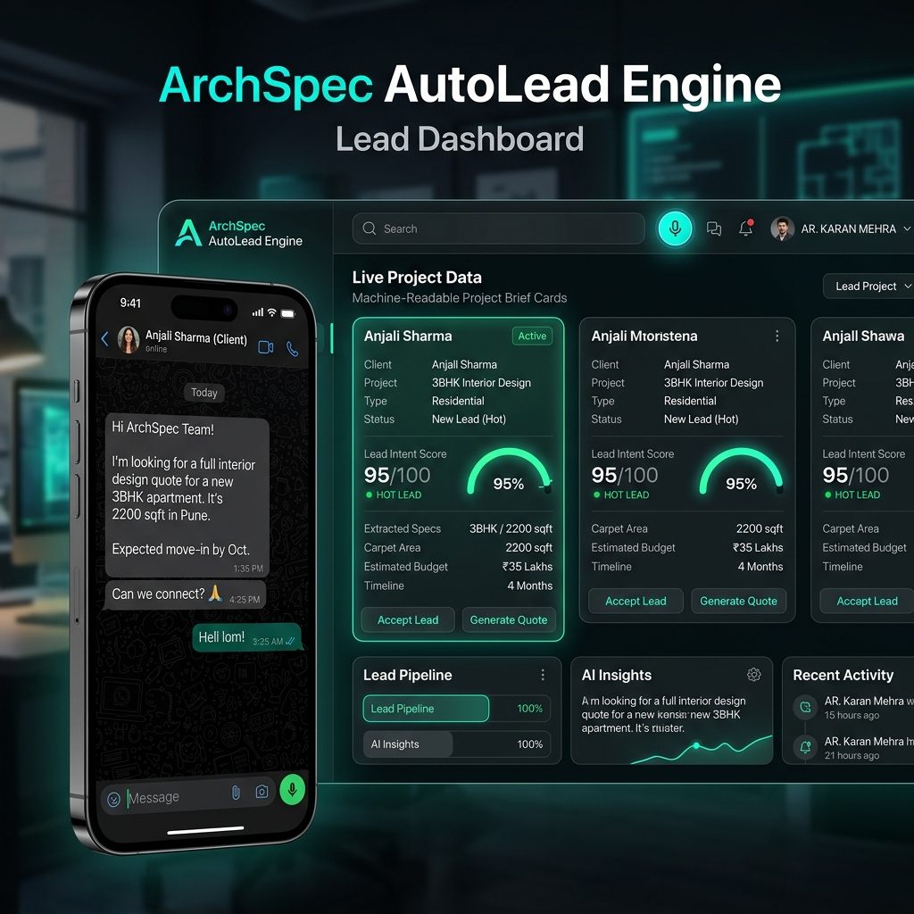
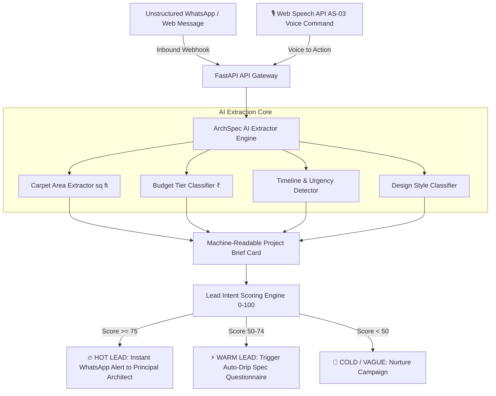

# 🏛️ ArchSpec AutoLead Engine
> **ArchScale Guild Intern Technology Hackathon Submission**  
> **Target Challenges:** `AS-05 — Build the marketing machine` (Primary) + `AS-03 — Voice Command Execution` (Secondary)  
> **Applicant:** Rafia Minhaj (`rafiaminhaj423@gmail.com`)  
> **Registration ID:** `REG-9FE9C39B`  



---

## 🏗️ System Architecture & Workflow Diagram



### 🔹 High-Level Architecture Component Flow

```
+-----------------------------------------------------------------------------------+
|                            INBOUND UNSTRUCTURED CHAT                              |
|   "Hi, 3BHK 2200 sqft penthouse in Koramangala, budget 35 Lakhs, start ASAP"      |
+-----------------------------------------+-----------------------------------------+
                                          |
                                          v
+-----------------------------------------------------------------------------------+
|                        FASTAPI BACKEND & SPEC EXTRACTOR                           |
|   • Regex & NLP Parameter Parser                                                  |
|   • Parameter Normalization (Sq Ft, INR Lakhs/Cr, Urgency)                        |
+-----------------------------------------+-----------------------------------------+
                                          |
                                          v
+-----------------------------------------------------------------------------------+
|                     MACHINE-READABLE PROJECT BRIEF CARD PDF                       |
|   • Property Scope: Apartment (3BHK Penthouse)                                    |
|   • Carpet Area: 2,200 sq ft                                                      |
|   • Estimated Budget: ₹35.0 Lakhs                                                 |
|   • Urgency: Immediate (< 1 Month)                                                |
+-----------------------------------------+-----------------------------------------+
                                          |
                                          v
+-----------------------------------------------------------------------------------+
|                      AUTOMATED WORKFLOW DISPATCH (AS-05)                          |
|   • Intent Score: 95/100 (HOT LEAD)                                               |
|   • Action: Instant WhatsApp Brief Dispatch to Principal Architect                |
|   • AS-03 Integration: Speech-to-Command Execution ("Show Qualified Leads")       |
+-----------------------------------------------------------------------------------+
```

---

## 🎯 1. Problem Understanding & Real Industry Friction
In 10-person architectural & interior design studios, marketing and lead qualification are heavily delayed or broken. 

**The Pain Points:**
1. **Unstructured Vague Inquiries:** Potential clients text vague inquiries on WhatsApp/Instagram (e.g., *"Need quote for interior design"*).
2. **Wasted Quoting Hours:** Architects spend 3–5 hours in back-and-forth phone calls trying to extract carpet area, budget, timeline, and design scope.
3. **Lost Leads:** Because architects are busy on site, lead responses are delayed by 24–48 hours, causing high lead drop-off rates.

---

## 💡 2. The Solution: One Intelligent Micro-Workflow
Rather than building another generic CRUD CRM dashboard or basic AI chatbot wrapper, **ArchSpec AutoLead Engine** implements a sharp **Architectural Specification Collector & Workflow Automation Engine**.

### Core Capabilities:
- 📩 **WhatsApp Webhook Ingestion:** Ingests raw client text messages in real-time.
- 🧠 **AI Architectural Spec Collector:** Automatically extracts 4 core parameters:
  - `Carpet Area (sq ft)`
  - `Budget Tier (₹ Lakhs / Crores)`
  - `Project Timeline & Urgency`
  - `Design Style Preference`
- 📋 **Machine-Readable Project Brief Card:** Instantly generates a structured 1-page Project Brief Card.
- 🎯 **Lead Intent Scoring Engine (0-100):** Classifies leads into Hot, Warm, or Vague tiers.
- ⚡ **Automated Workflow Action:** Sends instant WhatsApp alerts to the Principal Architect for qualified leads and triggers auto-drip questionnaires for missing details.
- 🎙️ **Voice Command Integration (AS-03):** Allows architects on site to query and trigger lead actions via speech-to-command execution.

---

## 🛠️ 3. Architecture & Tech Stack
- **Backend Core:** Python 3.13 + FastAPI + Pydantic
- **AI Core:** RegEx/NLP Architectural Specification Extractor & Lead Scoring Engine
- **Frontend UI:** Glassmorphism Dark Theme (HTML5, Vanilla CSS3, JavaScript ES6)
- **Voice Module:** Browser Web Speech API for AS-03 Voice Execution
- **Deployment:** Containerized for Vercel / Render

---

## 🚀 4. How to Run Locally

```bash
# Clone the repository
git clone https://github.com/Rafiaminhaj/archscale-lead-engine.git
cd archscale-lead-engine

# Install dependencies
pip install -r requirements.txt

# Start the server
python -m uvicorn app.main:app --host 127.0.0.1 --port 8005 --reload
```

Open `http://127.0.0.1:8005` in your browser to view the interactive studio dashboard and phone simulator!
