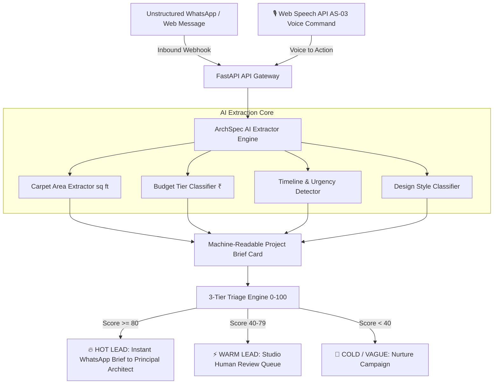

# 🏛️ ArchSpec AutoLead Engine
> **ArchScale Guild Intern Technology Hackathon Submission**  
> **Target Challenges:** `AS-05 — Build the marketing machine` (Primary) + `AS-03 — Voice Command Execution` (Secondary)  
> **Applicant:** Rafia Minhaj (`rafiaminhaj423@gmail.com`)  
> **Registration ID:** `REG-9FE9C39B`  


---

## 🎯 1. 3-Tier Automated Triage & Scoring Rubric

### 📊 Transparent Scoring Allocation (Judges Rubric)
`Scoring Rubric: Budget (25) > Area (20) > Scope (15) > Timeline (10-15) > Base (20). Hot ≥ 80 auto-dispatches to architect.`

| Metric | Max Points | Evaluation Criteria |
| :--- | :--- | :--- |
| **Base Touchpoint** | `+20 pts` | Verified Inbound Ingestion Channel |
| **Budget Tier** | `+25 pts` | Clear Budget Range Specified (e.g. ₹35L, ₹1.5 Cr) |
| **Carpet Area** | `+20 pts` | Specific Carpet Area (e.g. 2200 sq ft) |
| **Property Scope** | `+15 pts` | Penthouse, Apartment, Villa, Commercial |
| **Timeline / Urgency** | `+15 pts` | Start Date (< 1 Month, Immediate, 2-3 Months) |

### ⚡ 3-Tier Automated Triage Routing
1. **🔥 HOT LEAD (`Score >= 80`):** Auto-dispatches instant WhatsApp Project Brief Card to Principal Architect.
2. **⚡ WARM LEAD (`Score 40 - 79`):** Routes to Studio Human Review Queue & triggers interactive spec questionnaire.
3. **💬 COLD / VAGUE (`Score < 40`):** Enrolls in automated nurture drip campaign.

---

## 🏗️ System Architecture & Workflow Diagram



---

## 💡 2. The Solution: One Intelligent Micro-Workflow
Rather than building another generic CRUD CRM dashboard or basic AI chatbot wrapper, **ArchSpec AutoLead Engine** implements a sharp **Architectural Specification Collector & Workflow Automation Engine**.

### Core Capabilities:
- 📩 **WhatsApp Webhook Ingestion:** Ingests raw client text messages in real-time.
- 🧠 **AI Architectural Spec Collector:** Automatically handles typos (`2200sqft`) and budget ranges (`30-35L`).
- 📋 **Machine-Readable Project Brief Card:** Instantly generates a structured 1-page Project Brief Card with printable PDF modal.
- 🎯 **3-Tier Lead Intent Triage (0-100):** Transparent scoring & triage routing.
- 🎙️ **Voice Command Integration (AS-03):** Speech-to-command execution (`"Show hot leads"`).

---

## 🛠️ 3. Architecture & Tech Stack
- **Backend Core:** Python 3.13 + FastAPI + Pydantic
- **AI Core:** RegEx/NLP Architectural Specification Extractor & Lead Scoring Engine
- **Frontend UI:** Glassmorphism Dark Theme (HTML5, Vanilla CSS3, JavaScript ES6)
- **Deployment:** Live Production on Vercel Serverless (`https://archscale-lead-engine.vercel.app`)

---

## 🚀 4. How to Run Locally

```bash
# Clone the repository
git clone https://github.com/Rafiaminhaj/archscale-lead-engine.git
cd archscale-lead-engine

# Install dependencies
pip install -r requirements.txt

# Start the server
python -m uvicorn app.main:app --host 127.0.0.1 --port 8005 --reload
```
